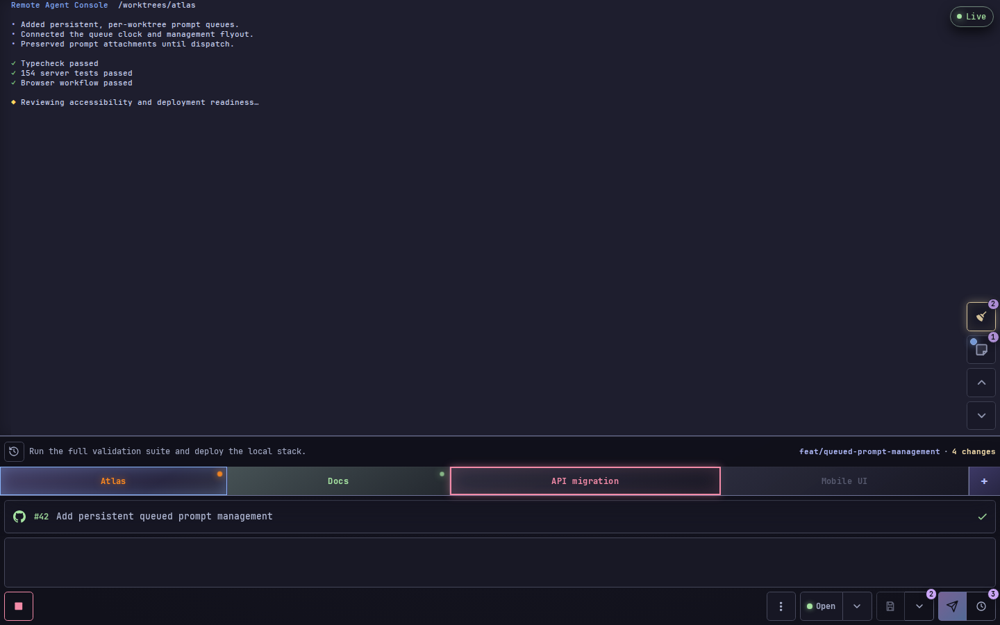
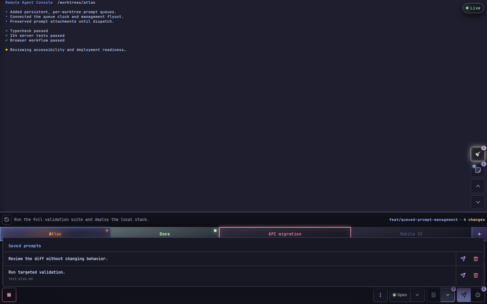
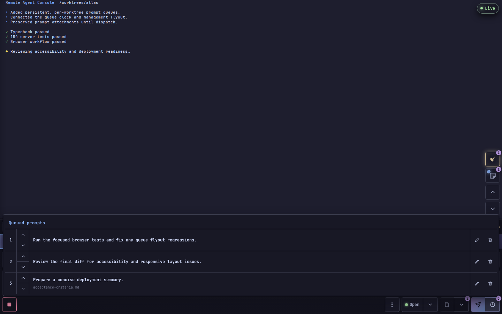
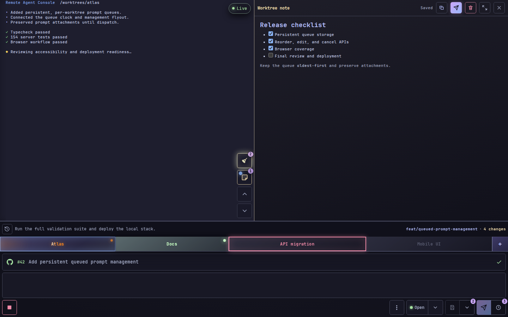
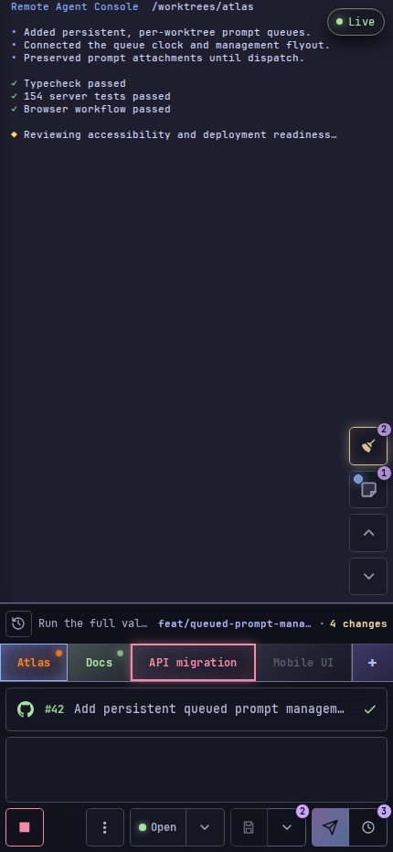
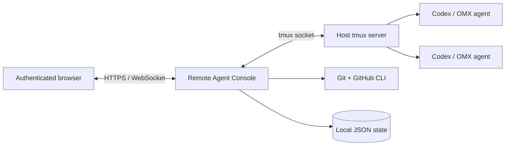

<p align="center">
  
</p>

<h1 align="center">Remote Agent Console</h1>

<p align="center">
  A self-hosted browser console for running Codex and OMX sessions across tmux worktrees.
</p>

<p align="center">
  <strong>Live output</strong> · <strong>Persistent prompt queues</strong> · <strong>Worktree context</strong> · <strong>Desktop and mobile</strong>
</p>



Remote Agent Console turns the Codex sessions already running in tmux into one
focused, authenticated workspace. Watch several agents, move between
worktrees, queue follow-up prompts, retain project notes, and inspect branch or
pull-request state without losing the terminal-native workflow underneath.

> [!IMPORTANT]
> This is a **single trusted operator** console. It can send input to terminals
> and execute worktree commands as the host account. Bind it to loopback and
> publish it only through an authenticated HTTPS proxy or tunnel.

## Highlights

| Area | Capabilities |
| --- | --- |
| **Agent overview** | Discover Codex/OMX descendants in tmux, see working/ready/action-required state, unread activity, and launch configured or scratch agents. |
| **Live output** | Stream the active pane, page through history, open detected links, copy selected output, answer guided questions, and temporarily switch to an interactive terminal. |
| **Prompt workflow** | Use per-worktree prompt history, arrow-key recall, saved drafts, attachments, skill/slash-command autocomplete, press-and-hold voice dictation, and persistent queued prompt management. |
| **Worktree context** | Show branch and full Git status, changed filenames, pull-request checks and review issues, GitHub Actions, project links, and trusted stack commands. |
| **Bookmarks and notes** | Bookmark Codex chats for exact resume, and keep autosaved Markdown notes beside output. Both can be isolated or shared across configured worktrees. |
| **Guided review** | Generate an AI-narrated tour of active Working or All PR implementation changes, visit or skip each logical step, and send consolidated feedback to the agent. |
| **Operations** | Install as a browser app, enable notifications, review stale runtime cleanup targets, and deploy with Docker Compose plus an optional Cloudflare Tunnel. |
| **Conversational control** | Connect ChatGPT through scoped remote MCP or use the built-in OpenAI Realtime voice dialog to inspect and direct the same agents. |

### Reuse saved drafts

Saved drafts stay attached to their worktree. The full-width flyout shows each
draft and its attachments, and lets you restore it to the composer, queue it
directly, or delete it.



### Review implementation changes

Open the branch-status flyout, choose **Working** or **All PR**, then select
**Review**. The console captures a fresh Git snapshot and generates a narrated
tour that explains how related implementation changes fit together. Tests and
documentation are excluded by default and can be included with the tour
toggles, which regenerates the snapshot.

The tour is explanatory rather than an automated code review: it does not
produce findings, verdicts, or patches. Visit or skip every logical step, add
feedback where useful, then optionally send one editable consolidated change
request to the active agent. Generation runs as a bounded, cancellable job and
the tour requires regeneration if the underlying changes move.

### Manage follow-up prompts

Prompts submitted while an agent is busy are stored per worktree. The clock
attached to **Queue** opens an oldest-first list where prompts can be reordered,
edited, or cancelled before they are dispatched.



### Keep context beside the output

Notes are persistent, autosaved, and rendered as Markdown. On wider screens
they share the output area; on narrow screens the layout adapts vertically.



<details>
<summary><strong>Mobile layout</strong></summary>



</details>

## How it works



The server discovers tmux panes, verifies that their process trees belong to
Codex/OMX, and streams bounded viewport captures to the browser. Prompts and
terminal input are sent only to the pane selected through a freshly validated
agent target. Persistent state—chat bookmarks, notes, prompt history, saved prompts, queues,
device names, and optional push subscriptions—stays in local JSON files.

## Requirements

- Linux with `/proc`
- Node.js 22+ and pnpm
- tmux
- An installed and authenticated Codex CLI
- A C/C++ build toolchain for `node-pty` when running outside Docker
- An HTTPS reverse proxy or tunnel for access beyond the local machine

Docker Compose is the recommended deployment because it packages Node, Codex,
tmux, and the native build/runtime dependencies. It starts in an isolated
scratch-only mode; connecting to a host tmux server and adding a public tunnel
are separate opt-in steps.

## Quick start

### 1. Install and create configuration

```bash
git clone https://github.com/anstosa/remoteagents.git
cd remoteagents
pnpm install

cp .env.example .env
cp config/remote-agent-console.example.json ~/remote-agent-console.json
```

Generate the two required secrets:

```bash
node -e "require('argon2').hash('choose-a-long-password',{type:require('argon2').argon2id}).then(console.log)"
node -e "console.log(require('crypto').randomBytes(32).toString('base64url'))"
```

Set `RAC_PASSWORD_HASH`, `RAC_SESSION_SECRET`, and `RAC_CONFIG` in `.env`, then
validate the scratch-only starter configuration:

```bash
pnpm config:check ~/remote-agent-console.json
```

### 2. Run directly

```bash
pnpm build
pnpm start
```

Open `http://127.0.0.1:8787`. Loopback HTTP is accepted only for local use;
every non-loopback deployment still requires canonical HTTPS.

### Or run with Docker Compose

Copy the scratch-only configuration into the ignored Compose location, then
start the console:

```bash
cp config/remote-agent-console.example.json config/remote-agent-console.docker.json
pnpm config:check --compose config/remote-agent-console.docker.json
docker compose up -d --build
docker compose ps
```

The default stack runs only the console and manages its own container-local
tmux sessions. Enable the optional Cloudflare sidecar with
`docker compose --profile tunnel up -d --build`.

After startup, use **Global settings → Add account** to connect one or more
ChatGPT accounts through device-code login and select the active Codex login.
Failed account queries offer **Re-login** without changing the active account.

Connecting Docker to existing host tmux sessions requires host-specific bind
mounts, worktree paths, and runtime settings. Follow the
[Docker Compose guide](docs/docker.md) for that optional bridge and for tunnel
setup. Keep host values in ignored `.env`, `compose.override.yaml`, and
`config/` files.

### Or run with systemd

To run directly as the host user, use the portable user-unit installer in the
[systemd deployment guide](docs/systemd.md). Native execution connects to the
user's tmux socket and Codex configuration without Docker bind mounts.

## Configuration

The `worktrees` array may be empty or omitted for scratch-only use. Each added
worktree has a stable ID, canonical path, label, and trusted launch command.
Optional fields expose project links, stack actions, new-task flows, and
customized prompt actions.

```json
{
  "listen": { "host": "127.0.0.1", "port": 8787 },
  "name": "My server",
  "publicOrigin": "https://agents.example.com",
  "remoteServers": [
    { "url": "https://other-agents.example.com" }
  ],
  "newAgentCommand": "codex",
  "worktrees": [
    {
      "id": "my-project",
      "label": "My project",
      "path": "/absolute/path/to/project",
      "command": "codex",
      "resumeCommand": "codex resume {threadId} -C .",
      "saveKey": "my-project",
      "pinned": true,
      "newTask": "detach && new {taskId}",
      "push": { "label": "Finish and PR", "prompt": "$finish" }
    }
  ]
}
```

`name` identifies the current Remote Agents server. Remote entries contain only
their canonical URL; each server publishes its own name and icon through the
authenticated peer-status API. The login, control, and output screens show one
direct navigation button for each server.

See [the setup reference](docs/setup.md) for the full security boundary,
worktree command behavior, browser capabilities, and operational checks.

## Everyday controls

| Control | Action |
| --- | --- |
| `Enter` | Queue the current prompt |
| `Shift+Enter` / `Ctrl+Enter` / `⌘+Enter` | Insert a newline |
| `↑` / `↓` | Recall older/newer prompt history when the cursor is on the first line |
| `Ctrl+S` / `⌘+S` | Save the current prompt as a draft |
| `Tab` | Insert a tab in the prompt; in terminal mode, send Tab to the pane |
| `$` or `/` | Open skill or slash-command completion |
| `Ctrl+C` with selected output | Copy the selection; without a selection in terminal mode, interrupt the process |

## Development

```bash
pnpm install
pnpm dev

pnpm lint
pnpm typecheck
pnpm test
pnpm build
```

Browser behavior is covered with Playwright specs under `apps/web/e2e`.
README screenshots are deterministic and use synthetic data:

```bash
pnpm --filter @rac/web screenshots:readme
```

See [CONTRIBUTING.md](CONTRIBUTING.md) before changing discovery, authentication,
tmux input, or worktree command boundaries.

## Repository layout

```text
apps/server/   Fastify API, tmux discovery/input, persistence, and integrations
apps/web/      React/Vite browser UI and Playwright coverage
config/        Example application and Cloudflare Tunnel configuration
docs/          Deployment guides and README screenshots
compose.yaml   Local production stack
```

## Documentation

- [Setup, configuration, and browser capabilities](docs/setup.md)
- [Docker Compose deployment](docs/docker.md)
- [systemd deployment](docs/systemd.md)
- [Using an existing Cloudflare Tunnel](docs/cloudflare-tunnel.md)
- [ChatGPT, MCP, Realtime voice, and federation](docs/integrations.md)
- [Security policy and deployment expectations](SECURITY.md)
- [Contributing and validation](CONTRIBUTING.md)

## Scope

Remote Agent Console is intentionally not a general-purpose web terminal or a
multi-user collaboration service. It is a focused remote control surface for
one operator's Codex/OMX worktrees. Authentication, strict Host/Origin checks,
short-lived WebSocket tickets, bounded caches, and target revalidation reduce
risk, but the console still inherits the privileges of the host account that
runs it.
